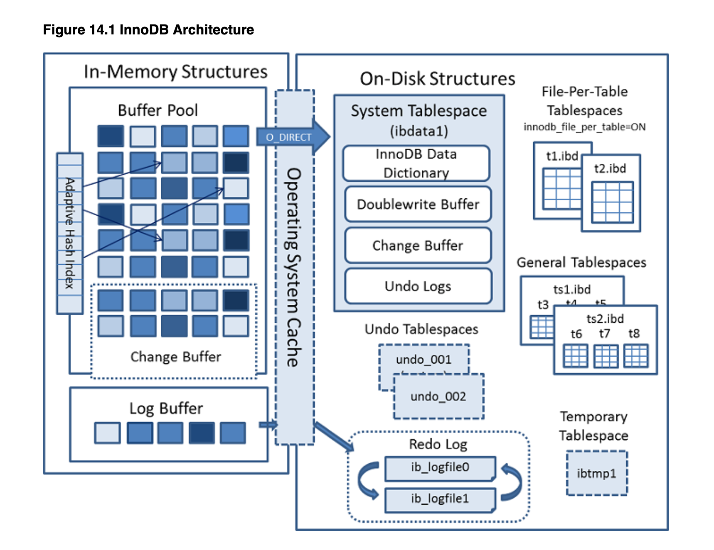
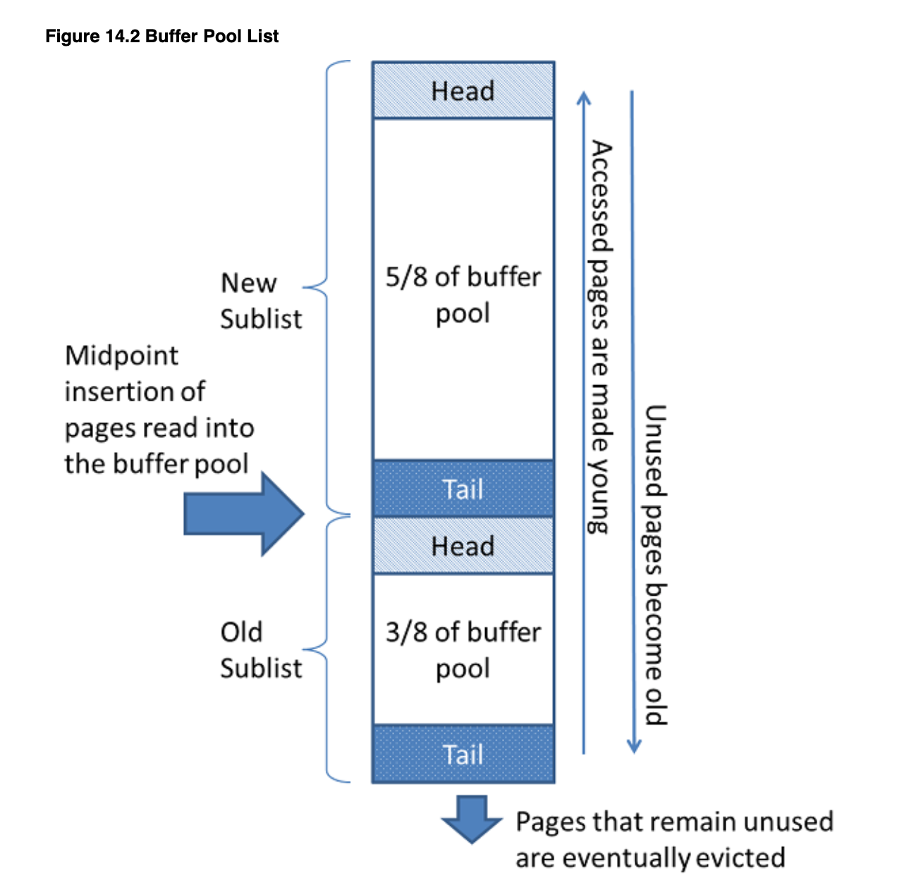
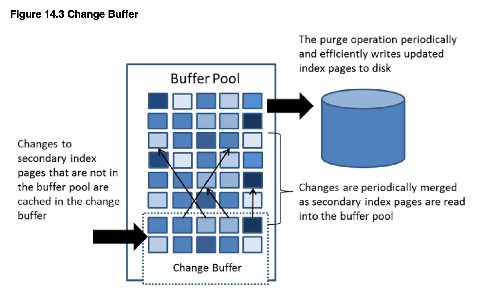

# 当我们讨论innodb时，我们在讨论什么
- [当我们讨论innodb时，我们在讨论什么](#当我们讨论innodb时我们在讨论什么)
  - [内存结构](#内存结构)
  - [磁盘结构](#磁盘结构)
  - [锁和事务](#锁和事务)
  - [备份与恢复](#备份与恢复)
  - [复制](#复制)
  - [一些有趣的问题](#一些有趣的问题)

我们在讨论这样一个结构:

## 内存结构

* 内存结构
  * Buffer Pool 一个磁盘页缓存
    * **用来干嘛的** innodb扫描磁盘上的表文件或索引文件时，会把磁盘数据加到到内存，加快后续的读取过程
    * **结构如何** Page List
      * 一个指向Page的列表；每个page固定大小，缓存磁盘数据
      * 列表分为前后两个部分。前2/3分是**New Pages**，代表最近访问的一些page；后1/3是**Old Pages**,最近没有访问的page
  
  
    * **算法策略** 
      * 变种的LRU
        * NewPages代表Recently Used Pages，是相对hot的缓存
        * OldPages代表Not Recently Used Pages，已经不那么hot，即将被淘汰
        * 如果一个query扫描了不在Buffer Pool里的page，innodb会把这些page加载到Buffer Pool 2/3的位置，并驱逐一些Old Pages
        * 如果访问了Old Pages，innodb会把这些Page移到New Pages
        * 这种变种的LRU，保持了相对好的弹性。如果新访问的Page，直接从磁盘移到New Pages最前面的位置，会造成一些空间浪费。特别是这些Page有可能只被访问一次就再也不访问了
      * 多个pool实例
        * 为什么允许多个pool实例呢？避免线程竞争。万一几个read线程，同时触发了磁盘页加载到Buffer Pool的过程，就会有竞争和等待。多个实例，允许innodb通过hash的方式去选择pool实例，提高了并发性能
      * 全表扫描、read ahead时，page插入哪个位置？
    * **如何观察** `show engine innodb status;` 查看`BUFFER POOL AND MEMORY`

  * Change Buffer 另一个磁盘页缓存
    * **用来干嘛** innodb修改某些数据时，并不会直接写磁盘，而是直接写内存缓存。一定时机下，才会写回磁盘页。当然，为了保证Persistance，innodb会先写redo log和undo log，避免宕机造成的内存数据丢失
    * **适用对象** 只适用于secondary索引 
    * **为什么要设计这个Change Buffer** 一般用到secondary索引时，我们更新的数据记录肯定是分布在B Tree某些节点位置上，这些位置很可能跨越了多个磁盘分页。如果我们直接写磁盘，就导致机械磁盘的非线性写入，性能下降。把写操作暂存到Change Buffer，合并一些随机写操作，变成批量写入，可以适当减少磁盘寻址的开销。
    * **什么时候发生merge** Change Buffer可以理解为脏页，
    * **遗留问题** 
      * Change Buffer在磁盘上是什么形式
      * 为什么可以survive a crash？
   
  
  * Adaptive Hash Index
  * Log Buffer

## 磁盘结构

我们掠过大部分不关心的磁盘结构，只关注和事务、锁、备份、复制相关的一些概念。

* 磁盘结构
  * Tables
    * `auto_increment`锁。这个锁服务于insert语句，有三种工作模式
      * traditional mode。 所有insert类的语句（会产生新记录的语句）在执行之前，获取表级别的自增锁，执行完之后释放锁。这种模式下，insert 事务只能串行工作。
      * consecutive mode，**即默认的自增锁模式，连续模式**。两种insert语句有不同的自增锁获取行为
        * 批量insert（insert into ... select * from ..）。这种insert在执行之前，往往不知道新增记录数，仍然需要获取表级别的自增锁。
        * 简单insert。一般在执行之前，就可以预知新增数据的数量。执行之前，即可提前分配好自增id，不需要长期占用自增锁，分配完id就可以释放锁。
        * 如果有批量insert占用了表级别自增锁，简单insert仍然需要等待表级别自增锁的释放。可以看出，如果你在搞批量insert，很可能会因为占用表级别自增锁，阻塞住其他常规的insert事务。
      * interleaved mode，交错模式。这种模式下，**所有insert语句都不占有表级别自增锁，所以并发性能拉满。insert事务只在真正需要自增id，采取获取锁、分配id、释放锁，所以临界区变得非常小**。这种模式带来一些问题
        * 如果你有批量insert，它们获取的自增id可能是不连续的
        * 在sql语句模式的复制场景里，slave和master的id很可能无法保持一致。在主从复制、读写分离的场景下，如果你的业务代码依赖了自增id，很可能会因此出现问题！
  * Indexes
    * 其实索引没什么好说的，clustered index和secondary index是老生常谈的问题。只关注一个细节。
    * **innodb并不是把每个page都填的满满当当，而是留出了一些空隙**。预留的这些空隙服务于将来的insert和update操作。如果有新的数据需要写入当前的索引page，如果page没有空闲空间导致溢出，就必须重新平衡相关的b+树结构。简单来说就是尽量避免B+树的再平衡。
  * Tablespaces 在深入到后续的内容之前，我们展示不要过多的探讨tablespace
  * Doublewrite Buffer
    * 什么机制？ buffer pool里的page被写入磁盘表文件之前，先写入doublewrite buffer。所以innodb在持久化数据时，是双写策略。如果磁盘文件写入过程发生了某些craash，innodb总是能在doublewrite buffer里找到合适的数据，进行恢复。
    * 效率如果保证？ doublewrite buffer是一块磁盘空间，写入时遵循批量原则，使用fsync从内存同步到磁盘，减少IO。
    * 里面存了啥？
  * Redo Log
    * 存的什么东西？ 每个事务引起了哪些数据变更
    * 有啥用？ 数据库crash后重新启动，可以使用redo log去继续完成未完成的数据操作
  * Undo Logs
    * 存的什么东西？ 每个事务的变更数据的原始版本。**仅限于clustered index的数据**
    * 有啥用？ 用于一致性读。暂时理解为，用于实现MVCC。每个事物在读取

## 锁和事务

## 备份与恢复

## 复制

## 一些有趣的问题

* buffer pool的算法机制如何
* change pool解决的问题是什么
* 自增锁有哪些工作模式，默认是哪种模式
* sql语句模式的复制场景下，自增锁有什么影响
* dobulewrite buffer的工作流程如何？有什么作用
* redo log和undo log存储了什么数据，用于哪些场景